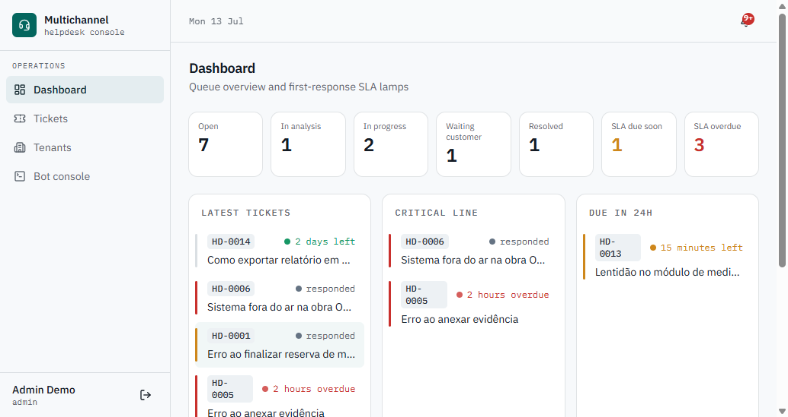
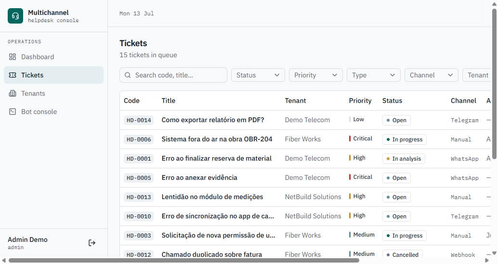
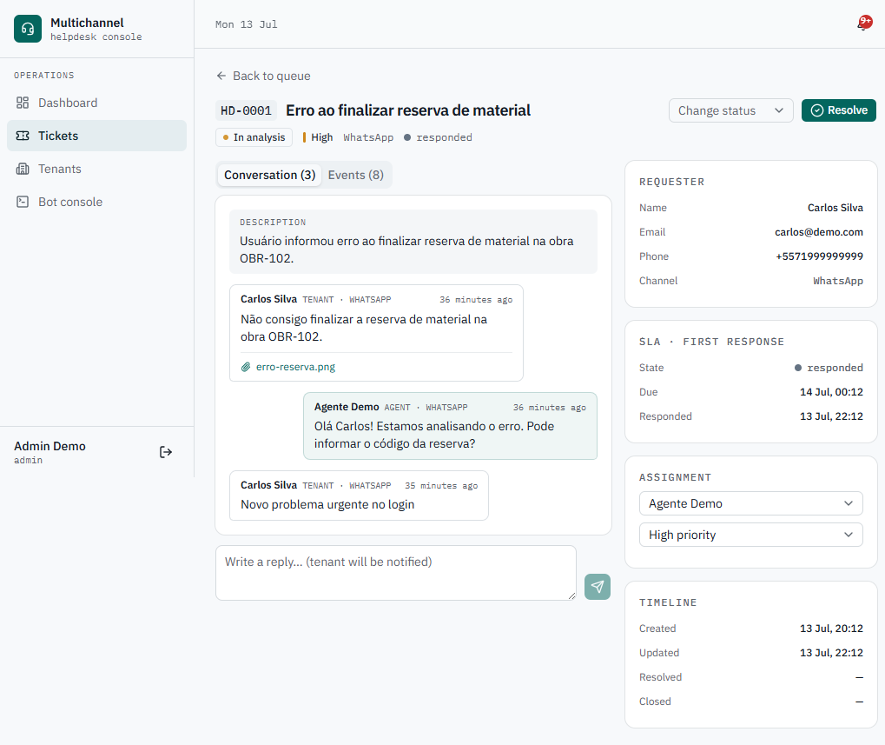
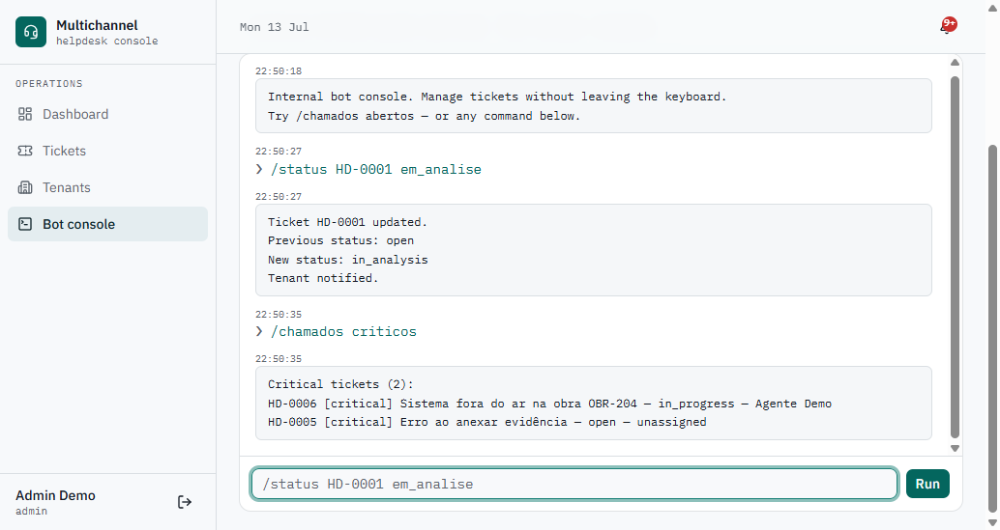

# Multichannel Helpdesk

> 🇧🇷 [Versão em português abaixo](#-versão-em-português)

A multichannel helpdesk system built with **FastAPI**, **MongoDB** and a clean, layered architecture.
It supports ticket management, tenant-based support, message history, SLA tracking, webhook-based
integrations, an internal command bot and automation-ready workflows.

**This is the public, demo version** — all data is fictional, integrations are simulated, and demo
logins are provided out of the box.



## The problem it solves

Support requests arrive from everywhere — WhatsApp, Telegram, webhooks, internal panels — and
end up scattered across chats with no history, no priority and no accountability. This system
centralizes every request as a **ticket** with a code (`HD-0001`), a tenant, a priority, a
first-response **SLA lamp** and a complete audit trail of messages and events.

## Features

- **Tickets** — create, list, filter, assign, prioritize, resolve, reopen, cancel; every action
  recorded as an auditable event
- **Multi-tenant** — tickets belong to client companies; tenant users only see their own tenant
- **SLA tracking** — first-response deadline per priority (critical 2h / high 4h / medium 24h /
  low 48h) with `ok / near_due / overdue / met` states surfaced across the UI
- **Multichannel intake** — webhook endpoints for WhatsApp, Telegram and a generic channel;
  adapters normalize payloads, dedupe by external id, find-or-create tickets and store raw payloads
- **Internal bot** — PT-BR commands (`/ver HD-0001`, `/status HD-0001 em_analise`,
  `/responder`, `/resolver`, `/atribuir`…) exposed through an API endpoint and a browser
  playground — ready to plug into a real Telegram/WhatsApp bot
- **Notifications** — in-app notification center + structured "fake email" logs (demo mode)
- **RBAC** — `admin`, `agent`, `tenant_user`, `viewer` with a strict permission matrix
- **Demo mode** — one-call seed (`POST /api/demo/seed`), reset, and a WhatsApp message simulator

## Stack

| Layer | Tech |
|---|---|
| API | Python 3.12, FastAPI, Pydantic v2 |
| Database | MongoDB (PyMongo Async), atomic counters, compound indexes |
| Auth | JWT (access + refresh), bcrypt |
| Frontend | Next.js 16 (App Router), TypeScript, Tailwind v4, shadcn/ui, TanStack Query |
| Tests | pytest + httpx (74 tests: unit + integration against real MongoDB) |
| Infra | Docker Compose, GitHub Actions |

## Architecture

```
Frontend (Next.js)
   ↓
API (FastAPI routes + RBAC deps)
   ↓
Application services (ticket, webhook, bot, notification, SLA, status flow)
   ↓
Repositories (PyMongo Async)
   ↓
MongoDB

External channels → Webhook adapter → normalize → find-or-create ticket → notify
Bot command      → Parser → same application services → formatted reply
```

Layers are strictly separated: `domain` (entities + enums), `application` (use cases / services,
pure logic like the SLA calculator and the status state machine), `infra` (Mongo repositories,
channel adapters) and `api` (routes, schemas, auth dependencies).

## Running locally

```bash
git clone https://github.com/<you>/multichannel-helpdesk
cd multichannel-helpdesk
docker compose up --build
```

Then:

1. Seed demo data: `curl -X POST http://localhost:8000/api/demo/seed`
2. Open the app: http://localhost:3000
3. Swagger docs: http://localhost:8000/docs

### Without Docker

```bash
# backend (needs a local MongoDB on :27017)
cd backend && uv sync && uv run uvicorn app.main:app --reload

# frontend
cd frontend && npm install && npm run dev
```

## Demo users

| Role | Email | Password |
|---|---|---|
| Admin | `admin@demo.com` | `demo123` |
| Agent | `agent@demo.com` | `demo123` |
| Tenant user | `tenant@demo.com` | `demo123` |
| Viewer | `viewer@demo.com` | `demo123` |

## Screenshots

| Tickets queue | Ticket detail |
|---|---|
|  |  |

| Bot console |
|---|
|  |

## Main endpoints

```
POST /api/auth/login          POST /api/auth/refresh         GET /api/auth/me
POST /api/tickets             GET  /api/tickets              GET /api/tickets/{id}
GET  /api/tickets/code/{code} POST /api/tickets/{id}/messages
POST /api/tickets/{id}/status POST /api/tickets/{id}/priority
POST /api/tickets/{id}/assign POST /api/tickets/{id}/resolve POST /api/tickets/{id}/reopen
GET  /api/tickets/{id}/events GET  /api/dashboard/stats
POST /api/webhooks/generic    POST /api/webhooks/whatsapp    POST /api/webhooks/telegram
POST /api/bot/command         GET  /api/notifications
POST /api/demo/seed           POST /api/demo/reset           POST /api/demo/simulate-whatsapp-message
GET  /health                  GET  /ready
```

Full OpenAPI/Swagger documentation at `/docs`.

## Simulating a WhatsApp message

```bash
curl -X POST http://localhost:8000/api/demo/simulate-whatsapp-message \
  -H "Content-Type: application/json" \
  -d '{"message": "Estou com um problema no login", "phone": "+5571999999999"}'
```

The message flows through the same webhook pipeline as a real WhatsApp integration:
payload → adapter → tenant/contact resolution → find-or-create ticket → notification.
Real webhook endpoints are protected by an `X-Webhook-Token` header.

## Ticket flow

```
open ⇄ in_analysis ⇄ in_progress ⇄ waiting_customer ⇄ waiting_internal
  └──────────────→ resolved ──→ closed
  └──────────────→ cancelled        └──→ reopen → open
```

- Resolving **requires a resolution message** (the tenant is notified)
- A tenant reply on a resolved/closed ticket **reopens it automatically**
- Every transition is validated by a state machine and recorded as an event

## Technical decisions

- **MongoDB** — the domain is document-shaped: variable message payloads per channel, flexible
  metadata, embedded requester/SLA. Reporting needs are simple, so no relational schema is needed.
- **PyMongo Async over Motor** — Motor is deprecated; PyMongo's native async API is its successor.
- **Services grouped by aggregate** — same layering the domain deserves without one-file-per-use-case
  ceremony; pure logic (SLA, status flow, ticket codes, bot parser) lives in isolated, unit-tested modules.
- **Synchronous notifications** — no Redis/worker in the MVP; the notification service is an
  interface-shaped seam where a queue can be introduced later.
- **JWT in localStorage** — acceptable for a demo; httpOnly cookies are the hardening path for
  production deployments.

## Roadmap

- [x] MVP: tickets, tenants, messages, events, SLA, dashboard, seed
- [x] Webhooks + channel adapters + payload dedup
- [x] Internal command bot + playground
- [ ] Real WhatsApp/Telegram gateways (private deployment)
- [ ] Redis + async workers for notifications
- [ ] Slack / Teams adapters
- [ ] AI assist: summaries, classification, suggested replies

## License

[MIT](LICENSE)

---

## 🇧🇷 Versão em português

Sistema de helpdesk multicanal desenvolvido com **FastAPI**, **MongoDB** e arquitetura em camadas.
Permite gestão de chamados, suporte por tenant, histórico de mensagens, controle de SLA, webhooks
e uma base preparada para automações com bots e IA.

**Esta é a versão pública de demonstração** — todos os dados são fictícios e as integrações são
simuladas.

### O problema

Solicitações de suporte chegam por todo lado — WhatsApp, Telegram, webhooks, painéis internos — e
se perdem em conversas sem histórico, prioridade ou responsável. Este sistema centraliza cada
solicitação como um **chamado** com código (`HD-0001`), tenant, prioridade, SLA de primeira
resposta e trilha completa de auditoria.

### Como rodar

```bash
docker compose up --build
curl -X POST http://localhost:8000/api/demo/seed
# App: http://localhost:3000 · Swagger: http://localhost:8000/docs
```

Logins demo: `admin@demo.com`, `agent@demo.com`, `tenant@demo.com`, `viewer@demo.com`
(senha `demo123` para todos).

### Destaques

- Chamados com eventos auditáveis, SLA por prioridade e máquina de estados de status
- Multi-tenant com isolamento por papel (`admin`, `agent`, `tenant_user`, `viewer`)
- Webhooks WhatsApp/Telegram/genérico com adapters, dedup e find-or-create de chamados
- Bot interno com comandos em português (`/ver HD-0001`, `/status`, `/responder`, `/resolver`…)
- Central de notificações no painel + logs estruturados
- Seed demo com 15 chamados realistas, simulador de mensagem WhatsApp
- 74 testes (unitários + integração com MongoDB real), CI no GitHub Actions
